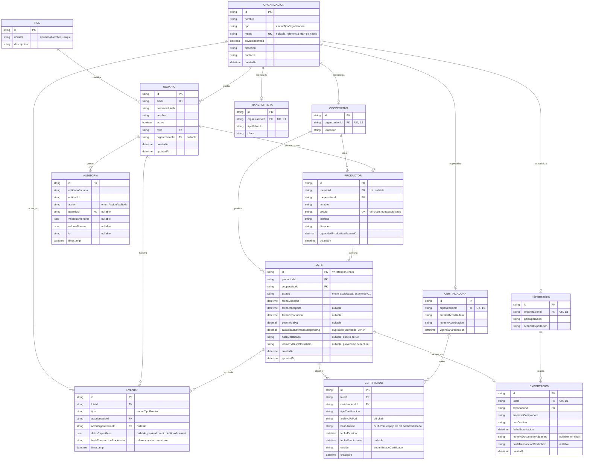

# Modelo Entidad-Relación Completo
**Proyecto:** Sistema de Trazabilidad Descentralizado basado en Blockchain para la Cadena de Suministro de Cacao Orgánico de Exportación
**Sprint:** 0 — Fundación

Este documento define el modelo entidad-relación completo de PostgreSQL. No repite el diseño de blockchain (Fase II); solo referencia los contratos ya congelados (C1–C4) donde es necesario para justificar decisiones de modelado.

---

## 1. Diagrama Entidad-Relación (ERD)



---

## 2. Entidades — resumen funcional

| Entidad | Rol en el sistema |
|---|---|
| **Roles** | Catálogo de roles del sistema, base de la matriz de permisos C7. |
| **Usuarios** | Cuentas de acceso (login/JWT), un rol y opcionalmente una organización. |
| **Organizaciones** | Tabla padre de todo actor institucional (cooperativa, certificadora, transportista, exportador); referencia el `mspId` de Fabric para los actores que son organizaciones validadoras de la red (WP-20). |
| **Productores** | Persona/finca afiliada a una cooperativa; dueña de los lotes. |
| **Cooperativas** | Especialización de Organización; recibe cosecha, registra fermentación/secado, crea lotes. |
| **Certificadoras** | Especialización de Organización; emite certificados de calidad/orgánico. |
| **Transportistas** | Especialización de Organización; ejecuta el transporte del lote. |
| **Exportadores** | Especialización de Organización; concreta la exportación final. |
| **Lotes** | Unidad central de trazabilidad; proyección de lectura del estado on-chain (§4). |
| **Eventos** | Historial de hitos de cada lote; proyección de lectura del array `historialEventos` on-chain (§4). |
| **Certificados** | Metadatos y archivo del certificado emitido para un lote. |
| **Exportaciones** | Cierre del ciclo de vida de un lote (estado `Exportado` de C1). |
| **Auditoría** | Bitácora de mutaciones a nivel de API/sistema (login, CRUD administrativo) — **no** es el historial de blockchain, que ya vive en Eventos/Lotes. |

---

## 3. Relaciones y cardinalidades

| Relación | Cardinalidad | Notas |
|---|---|---|
| Rol → Usuario | 1:N | Un rol puede tener muchos usuarios. |
| Organización → Usuario | 1:N (opcional) | Admin/Comprador pueden no pertenecer a una organización. |
| Organización → Cooperativa/Certificadora/Transportista/Exportador | 1:1 (opcional) | Discriminado por `Organizacion.tipo`; patrón de especialización. |
| Cooperativa → Productor | 1:N | Un productor pertenece a una sola cooperativa. |
| Cooperativa → Lote | 1:N | La cooperativa que gestionó la recepción/fermentación. |
| Usuario → Productor | 1:1 (opcional) | No todo productor tiene cuenta de acceso propia. |
| Productor → Lote | 1:N | Un productor puede tener múltiples cosechas/lotes. |
| Lote → Evento | 1:N | Cada hito (creación, fermentación, certificación, transporte, exportación, corrección) es un evento. |
| Usuario → Evento | 1:N | Actor que ejecuta/registra el evento. |
| Organización → Evento | 1:N (opcional) | Organización a la que pertenece el actor al momento del evento. |
| Lote → Certificado | 1:N | Permite recertificaciones sin perder historial. |
| Certificadora → Certificado | 1:N | — |
| Lote → Exportación | 1:1 (opcional) | Solo existe una vez que el lote llega a estado `Exportado`. |
| Exportador → Exportación | 1:N | — |
| Usuario → Auditoría | 1:N (opcional) | Eventos de sistema sin usuario autenticado (ej. intento de login fallido) quedan con `usuarioId = null`. |

---

## 4. Separación on-chain / off-chain

### 4.1 Matriz de campos

| Campo (Postgres) | Entidad | Ubicación | Justificación |
|---|---|---|---|
| `id` (loteId), `estado`, `fechaCosecha`, `fechaTransporte`, `fechaExportacion`, `hashCertificado` | Lote | **Espejo de on-chain (C2)** | Postgres necesita estos campos para búsquedas/joins/dashboard (WP-16); Fabric no ofrece consultas SQL. Fuente de verdad = ledger; Postgres es proyección sincronizada vía Fabric Gateway (WP-22). |
| `capacidadEstimadaSnapshotKg` | Lote | **Duplicado deliberado** | Se envía como parámetro a `CreateLot` (C4) y queda embebido en el registro on-chain para que el chaincode valide `RegisterFermentation` (regla de peso máximo) sin depender de una consulta externa a Postgres durante el consenso. |
| `capacidadProductivaMaximaKg` | Productor | **Off-chain, fuente de verdad** | Dato administrativo de la finca; solo su snapshot viaja on-chain (ver fila anterior). |
| `hashTransaccionBlockchain` | Evento, Lote, Exportación | **Referencia, no duplicado** | Puntero al `txId`/bloque de Fabric; permite auditar/verificar sin repetir el contenido de la transacción. |
| `hashArchivo` | Certificado | **Espejo de `hashCertificado` (C2)** | El hash SHA-256 vive en ambos lados por diseño (C2/C3): on-chain para integridad verificable, off-chain junto al archivo real para poder recalcularlo y compararlo. |
| `datosEspecificos` (JSON) | Evento | **Off-chain únicamente** | Detalle operativo (peso, ruta, tiempos) que no necesita vivir on-chain; on-chain solo requiere el evento resumido (`actor`, `timestamp`, `tipo` — C2.`historialEventos`). |
| `cedula`, `telefono`, `direccion` | Productor | **Off-chain, nunca on-chain** | Prohibido explícitamente por Fase II §6. |
| `numeroDocumentoAduanero`, `licenciaExportacion`, `numeroAcreditacion`, `placa` | Exportación / Exportador / Certificadora / Transportista | **Off-chain únicamente** | Dato regulatorio/documental sin relevancia para el consenso. |
| `passwordHash`, `mspId` | Usuario, Organización | **Off-chain / configuración de red, no es dato de trazabilidad** | Credenciales de acceso a la app y a la red Fabric; nunca se registran como transacción de negocio. |
| `archivoPdfUrl`, fotografías, facturas, resultados de laboratorio (referenciados desde Certificado/Evento) | — | **Off-chain (C3)** | Solo el hash de estos archivos existe on-chain. |
| `valoresAnteriores`, `valoresNuevos`, `ip` (Auditoría) | Auditoría | **Off-chain únicamente** | Bitácora de sistema, no de negocio; no aplica a blockchain. |

### 4.2 Regla de "no duplicidad innecesaria"

Solo existen dos duplicaciones de valor entre Postgres y blockchain, y ambas están justificadas arriba:

1. **Lote como proyección de lectura** del estado on-chain (necesaria por limitaciones de consulta de Fabric).
2. **`capacidadEstimadaSnapshotKg`** embebido on-chain (necesario para que el chaincode valide sin dependencias externas — mitigación ya definida en Fase I).

Todo lo demás (datos personales, documentos, credenciales, metadatos regulatorios) vive exclusivamente en un solo lado, según C2/C3.

---

## 5. Enums usados en el modelo

```
RolNombre           = ADMIN | PRODUCTOR | COOPERATIVA | CERTIFICADORA | TRANSPORTISTA | EXPORTADOR | COMPRADOR
TipoOrganizacion    = COOPERATIVA | CERTIFICADORA | TRANSPORTISTA | EXPORTADOR
EstadoLote          = CREADO | FERMENTANDO | CERTIFICADO | EN_TRANSPORTE | EXPORTADO   (== C1, orden estricto)
TipoEvento          = CREACION | FERMENTACION | CERTIFICACION | TRANSPORTE | EXPORTACION | CORRECCION
EstadoCertificado   = VIGENTE | VENCIDO | REVOCADO
AccionAuditoria     = CREATE | UPDATE | DELETE | LOGIN | LOGIN_FAILED | EXPORT | OTHER
```

`EstadoLote` reproduce exactamente C1; `TipoEvento` incluye `CORRECCION` para soportar la regla de Fase I de que una corrección se registra como evento nuevo, nunca como edición del anterior.

---

## 6. Trazabilidad hacia Prisma

El modelo completo está traducido 1:1 a `database/schema.prisma`, listo para copiarse a `backend/prisma/schema.prisma` en WP-02. Toda entidad, campo, enum y relación de este documento tiene su contraparte exacta en ese archivo.
